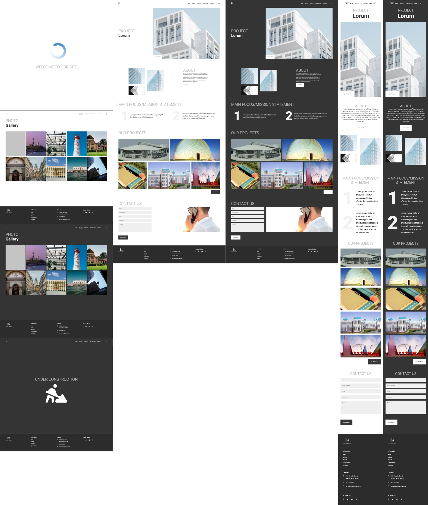

# SuperCode Architect Portfolio Project

## Purpose of the website

- Create an Architect Portfolio Website
- Create a Dark-Light Mode
- Implement a Loading Screen
- Dynamic Routing with React Router DOM

## Built with

- Mobile Design
- Grid and Flexbox Layout
- React
- React Router DOM

## Links

- [See live site here](https://supercode-architect-portfolio-react.onrender.com)
- [GitHub Repository](https://github.com/thomaserdmenger/superCode-Architect-Portfolio-React)
- [GitHub Author](https://github.com/thomaserdmenger)
- [LinkedIn Author](https://www.linkedin.com/in/thomaserdmenger/)

## Screenshot-Image

